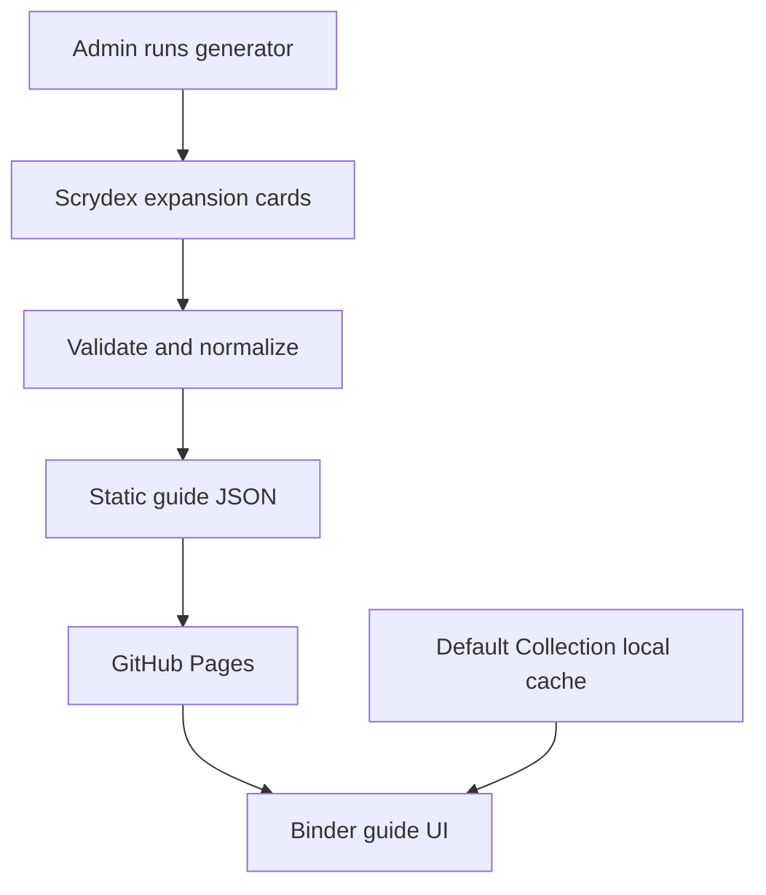

# PokeValuator Master Set Binder Guide

## Implementation and Copilot handoff specification

Status: foundational implementation completed on `feature/master-set-binder-guides`

Base branch: `origin/dev` at `c4e7e94`

Feature type: static master-set guide manifests with browser-only binder rendering

Pricing: explicitly out of scope

## 1. Goal

Add a mobile-first binder-planning page under Master Sets that displays every supported card and collectible variant in binder order.

Supported variants:

1. `normal`
2. `reverseHolofoil`
3. `energyReverseHolofoil`
4. `pokeBallReverseHolofoil`
5. `rocketReverseHolofoil`
6. `quickBallReverseHolofoil`
7. `duskBallReverseHolofoil`
8. `loveBallReverseHolofoil`
9. `friendBallReverseHolofoil`
10. `cosmosHolofoil`
11. `holofoil`

The guide must:

- show variant-specific Scrydex images when available;
- fall back to the base card image when a variant image is absent;
- overlay owned/missing status from the existing Default Collection;
- support 3 × 3, 4 × 3, and 4 × 4 binder pages;
- render only the active binder page;
- never display or fetch pricing;
- add no Firestore catalog reads or writes;
- add no Redis dependency;
- use Scrydex credits only when an administrator generates or refreshes a manifest.

## 2. Architecture decision



This architecture intentionally avoids storing the public card catalog in Firestore.

At runtime, one guide visit requires:

- one static JSON request;
- only the images visible on the active binder page;
- zero Scrydex API requests;
- zero Redis commands;
- zero Firestore catalog reads;
- zero new Firestore writes.

The only local write is an optional browser preference containing binder size and enabled variant filters.

## 3. Credit estimate

Scrydex returns up to 100 cards per search page. The generator uses the expansion-scoped card endpoint.

| Expansion | Scrydex card records | Expected generation requests |
|---|---:|---:|
| Ascended Heroes (`me2pt5`) | 295 | 3 |
| Pitch Black (`me5`) | 120 | 2 |
| Both | 415 | 5 |

Do not call the individual card-detail endpoint for every card. That would turn the same initial generation into approximately 415 requests instead of five.

The generator request must not include `include=prices` or `include=pop_reports`.

## 4. Implemented files

| File | Responsibility |
|---|---|
| `scripts/master-set-guide-core.mjs` | Variant allowlist, transformation, image resolution, manifest validation |
| `scripts/generate-master-set-guide.mjs` | Scrydex pagination, environment credentials, atomic JSON writes, guide index update |
| `data/master-set-guides/index.json` | Allowlist of published guides; controls whether the Plan Binder link appears |
| `data/master-set-guides/overrides/README.md` | Reviewed exception format |
| `master-set-guide.html` | Binder guide document and accessible controls |
| `master-set-guide.css` | Responsive binder layout |
| `master-set-guide.js` | Safe rendering, filtering, pagination, details dialog, ownership overlay |
| `master-set-guide-link.js` | Shows the Plan Binder button only for generated guides |
| `tests/master-set-guide-core.test.mjs` | Generator and validation coverage |
| `tests/master-set-guide-ui-static.test.mjs` | XSS, image URL, pricing, and variant regression coverage |

`master-set.html` now contains a hidden **Plan Binder Layout** link. The link becomes visible only when the selected expansion appears in `data/master-set-guides/index.json`.

## 5. Scrydex request

The generator calls:

```text
GET /pokemon/v1/expansions/{expansionId}/cards
    ?page={page}
    &pageSize=100
    &orderBy=expansion_sort_order
    &select=id,name,number,printed_number,rarity,supertype,images,expansion,expansion_sort_order,variants
```

Expected request headers:

```text
X-Api-Key: <SCRYDEX_API_KEY>
X-Team-ID: <SCRYDEX_TEAM_ID>
Accept: application/json
```

Credentials must remain in the terminal environment or repository secrets. Never place them in JavaScript served to the browser, JSON guide files, source control, screenshots, or Copilot prompts.

## 6. Generate a guide in VS Code

Open the repository terminal at the project root.

### Windows PowerShell

```powershell
$env:SCRYDEX_API_KEY="your-key"
$env:SCRYDEX_TEAM_ID="your-team-id"

node scripts/generate-master-set-guide.mjs --set me2pt5 --dry-run
node scripts/generate-master-set-guide.mjs --set me2pt5

Remove-Item Env:SCRYDEX_API_KEY
Remove-Item Env:SCRYDEX_TEAM_ID
```

Pitch Black:

```powershell
$env:SCRYDEX_API_KEY="your-key"
$env:SCRYDEX_TEAM_ID="your-team-id"

node scripts/generate-master-set-guide.mjs --set me5 --dry-run
node scripts/generate-master-set-guide.mjs --set me5

Remove-Item Env:SCRYDEX_API_KEY
Remove-Item Env:SCRYDEX_TEAM_ID
```

### Bash

```bash
export SCRYDEX_API_KEY="your-key"
export SCRYDEX_TEAM_ID="your-team-id"

node scripts/generate-master-set-guide.mjs --set me2pt5 --dry-run
node scripts/generate-master-set-guide.mjs --set me2pt5

unset SCRYDEX_API_KEY SCRYDEX_TEAM_ID
```

Always run `--dry-run` first. It consumes the same API requests but does not write files, so avoid running it repeatedly without a reason. A normal dry run followed by a write run doubles the one-time request estimate from three to six for Ascended Heroes. If credits are especially tight, run the write command once and rely on the generator validation.

## 7. Generated output

Successful generation creates:

```text
data/master-set-guides/me2pt5.json
```

It also updates:

```text
data/master-set-guides/index.json
```

The manifest stores card metadata once and represents each binder requirement as a slot:

```json
{
  "slotId": "me2pt5-7:energyReverseHolofoil",
  "cardId": "me2pt5-7",
  "variant": "energyReverseHolofoil",
  "label": "Energy Reverse Holofoil",
  "images": {
    "small": "https://images.scrydex.com/pokemon/me2pt5-7erh/small",
    "medium": "https://images.scrydex.com/pokemon/me2pt5-7erh/medium"
  },
  "imageSource": "variant"
}
```

The output cannot contain:

- `prices`
- `pop_reports`
- `popReports`
- `marketplaces`

The validator rejects a manifest containing any of these fields.

## 8. Variant-image rules

Image priority:

1. reviewed override;
2. Scrydex `variant.images` front image;
3. Scrydex base `card.images` front image;
4. image-unavailable placeholder.

Example from the supplied Ascended Heroes response:

| Variant | Expected image behavior |
|---|---|
| `normal` | use the variant `-n` image |
| `energyReverseHolofoil` | use the variant `-erh` image |
| `pokeBallReverseHolofoil` | use the variant `-pb` image |
| `rocketReverseHolofoil` | use its variant image when supplied; otherwise use the base image |
| `quickBallReverseHolofoil` | use its variant image when supplied; otherwise use the base image |
| `duskBallReverseHolofoil` | use its variant image when supplied; otherwise use the base image |
| `loveBallReverseHolofoil` | use its variant image when supplied; otherwise use the base image |
| `friendBallReverseHolofoil` | use its variant image when supplied; otherwise use the base image |
| `cosmosHolofoil` with an empty image array | use the base card image and keep the Cosmos label visible |
| `holofoil` on a rarity ending in `Hyper Rare` | use the base card image because Scrydex's gold-card variant render can wash out the etched artwork |

Never manufacture a URL by guessing a Scrydex suffix. A guessed image can show the wrong treatment or break later.

## 9. Reviewed overrides

Create an override only when the generated report identifies a real exception:

```text
data/master-set-guides/overrides/me2pt5.json
```

```json
{
  "variantImageOverrides": {
    "me2pt5-7:cosmosHolofoil": {
      "small": "https://verified.example/tangela-cosmos-small",
      "medium": "https://verified.example/tangela-cosmos-medium",
      "large": "https://verified.example/tangela-cosmos-large"
    }
  },
  "excludedSlots": []
}
```

After changing an override, rerun the generator so the published manifest contains the reviewed result.

The generator automatically uses the clean base card image for a `holofoil`
slot when the card rarity ends in `Hyper Rare` (including `Mega Hyper Rare`).
This covers current and future gold cards without maintaining a list of card
IDs. Other rarities continue to prefer their variant-specific images.

The initial implementation supports:

- variant-image overrides;
- excluding an incorrect slot.

Promos from another expansion and manually added slots should be added in a later, reviewed change. Do not silently mix additional expansion IDs into the normal Scrydex response because the generator deliberately rejects mismatched expansions.

## 10. Ownership matching

The page reads the existing browser collection key:

```text
pv:scrydex:collection:v1
```

Only card items in the Default Collection are considered. Ownership is matched using:

```text
cardId + normalized variant name
```

The guide reads `variantQuantities` first and uses `selectedVariant` only as a compatibility fallback. The old value `Standard` is normalized to `normal`.

The binder page does not create a second progress model and does not write progress to Firestore. Existing Dex synchronization remains the single source of ownership state.

## 11. Rendering and performance rules

- Render only the active binder page: 9, 12, or 16 slots.
- Do not render all 600+ slots and hide them with CSS.
- Use the small image in the grid.
- Use the medium image only in the details dialog.
- Do not include large image URLs in the manifest.
- Preserve lazy loading and asynchronous image decoding.
- Reset to page one whenever filters change.
- Disable previous/next navigation at page boundaries.
- Keep search, binder math, ownership filtering, and variant filtering in the browser.

For 613 slots:

| Binder | Slots per page | Pages |
|---|---:|---:|
| 3 × 3 | 9 | 69 |
| 4 × 3 | 12 | 52 |
| 4 × 4 | 16 | 39 |

## 12. Security rules

All manifest data, URLs, local storage, and query parameters are untrusted.

- Build rendered content with DOM creation APIs.
- Put text into `textContent`.
- Validate an image URL before assigning it to `src`.
- Accept HTTPS images or same-origin images only.
- Validate `expansionId` against `^[a-zA-Z0-9._-]+$` before constructing a path.
- Keep the repository XSS static test passing.
- Do not add HTML parsing sinks to the new renderer.
- Do not expose Scrydex secrets in client-side code.

## 13. Testing commands

Focused feature tests:

```bash
node --test tests/master-set-guide-core.test.mjs tests/master-set-guide-ui-static.test.mjs
```

Syntax checks:

```bash
node --check scripts/master-set-guide-core.mjs
node --check scripts/generate-master-set-guide.mjs
node --check master-set-guide.js
node --check master-set-guide-link.js
```

Repository XSS guardrail:

```bash
node xss-sink-static.test.mjs
```

Run the complete root test suite before merging:

```bash
node --test *.test.mjs tests/*.test.mjs
```

If the shell does not expand both patterns on Windows, run:

```powershell
Get-ChildItem -File -Recurse -Filter *.test.mjs | ForEach-Object { node --test $_.FullName }
```

## 14. Manual regression checklist

### Guide generation

- [ ] Generator uses the expansion-scoped endpoint.
- [ ] Page size is 100.
- [ ] Ascended Heroes takes approximately three requests.
- [ ] Pitch Black takes approximately two requests.
- [ ] No card-detail request is issued per card.
- [ ] Output contains no pricing, trends, population reports, or marketplace links.
- [ ] Unknown Scrydex variants produce warnings instead of silently becoming slots.
- [ ] Duplicate variants do not create duplicate slots.
- [ ] `index.json` is updated after a successful write.

### Variant correctness

- [ ] All eleven approved variant types appear when present in Scrydex.
- [ ] Normal uses its variant image when available.
- [ ] Holofoil uses its variant image when available.
- [ ] Energy Reverse Holofoil uses its variant image when available.
- [ ] Poké Ball Reverse Holofoil uses its variant image when available.
- [ ] Empty variant image arrays fall back to the base image.
- [ ] The visible badge always identifies the variant, even when images are shared.
- [ ] Secret rares and numbers above the printed total remain in Scrydex order.

### UI behavior

- [ ] Plan Binder Layout remains hidden for a set with no generated guide.
- [ ] Plan Binder Layout appears for a set listed in `index.json`.
- [ ] 3 × 3 renders at most nine active slots.
- [ ] 4 × 3 renders at most twelve active slots.
- [ ] 4 × 4 renders at most sixteen active slots.
- [ ] Search matches name and card number.
- [ ] Variant toggles update slot and page counts.
- [ ] Owned and missing filters use the Default Collection.
- [ ] Card dialog displays image, name, number, rarity, variant, and ownership only.
- [ ] No price appears or loads.
- [ ] Mobile grid remains readable at 320 px width.
- [ ] Browser back navigation returns to the same master-set details page.

### Existing-feature regression

- [ ] Master Sets listing still loads.
- [ ] Existing collected/missing master-set details still load.
- [ ] Dex add/remove and variant quantities are unchanged.
- [ ] Firebase sync behavior is unchanged.
- [ ] Card search and sealed search are unchanged.
- [ ] Existing pricing pages are unchanged.

## 15. Local preview

Do not open the HTML file directly with a `file://` URL because browser fetch restrictions can block the guide JSON.

From the repository root:

```bash
python -m http.server 8000
```

Then visit:

```text
http://localhost:8000/master-set-guide.html?expansionId=me2pt5&expansionName=Ascended%20Heroes
```

The page will show “not generated yet” until `data/master-set-guides/me2pt5.json` exists.

## 16. Known gotchas

1. **Search-field behavior:** Verify one live generator run confirms `select=variants` preserves nested `variant.images`. If the account response strips nested images, remove `select` and fetch the complete paginated card objects. That still costs approximately three requests for Ascended Heroes. Do not replace it with one request per card.
2. **Empty images are valid:** A variant may be real while its image array is empty. This is a warning, not a generation failure.
3. **Promos can live outside the expansion:** Handle these with an explicit, reviewed future configuration. Do not broaden the normal expansion import without tests.
4. **Set composition can change shortly after release:** Generate at launch, review, and refresh only when Scrydex corrects metadata or images.
5. **The index controls publishing:** Committing a manifest without the index entry leaves the normal Plan Binder button hidden.
6. **Generated JSON is source-controlled:** Review manifest count changes like application code.
7. **Browser cache:** After deploying a corrected manifest, GitHub Pages or the browser may temporarily serve the prior file. If this becomes an issue, add a manifest version query from the index entry.
8. **Copyright and attribution:** Continue following Scrydex and Pokémon image-use requirements. The feature references Scrydex-hosted images and should retain site-wide attribution where required.

## 17. Copilot instructions

Use this exact scope when asking Copilot to continue the implementation:

> Work only within the Master Set Binder Guide feature described in `docs/MASTER_SET_BINDER_GUIDE_IMPLEMENTATION_SPEC.md`. Preserve existing Dex, Firebase, pricing, search, and master-set behavior. Do not add Firestore or Redis storage for guide catalogs. Do not request prices or population reports. Use only the eleven approved variant identifiers. Preserve variant-specific images with reviewed fallback behavior. Treat JSON, URLs, query parameters, and local storage as untrusted. Build UI nodes with safe DOM APIs and keep all existing and new tests passing. If a requirement is unclear or requires a new API call per card, stop and explain the tradeoff before changing the architecture.

## 18. Rollout plan

1. Generate Ascended Heroes only.
2. Review generator warnings and the eleven variant counts.
3. Compare a sample of each variant with Scrydex and a trusted checklist.
4. Add only verified image overrides.
5. Test mobile and desktop binder sizes.
6. Deploy behind the generated-guide index allowlist.
7. Monitor image load performance and guide usage.
8. Generate Pitch Black after the first guide is verified.
9. Add other sets gradually instead of importing the entire historical catalog immediately.

## 19. Merge requirements

Do not merge until:

- the complete automated suite passes;
- at least one real manifest is reviewed;
- no credentials appear in the diff;
- a browser test confirms no runtime Scrydex card request;
- Network tools show no Firestore guide-catalog calls;
- the binder loads no more than the current page’s card images;
- the Plan Binder link remains hidden for unsupported expansions.
