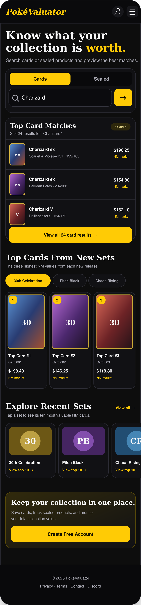
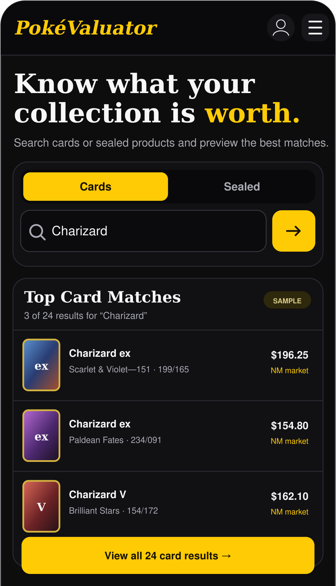
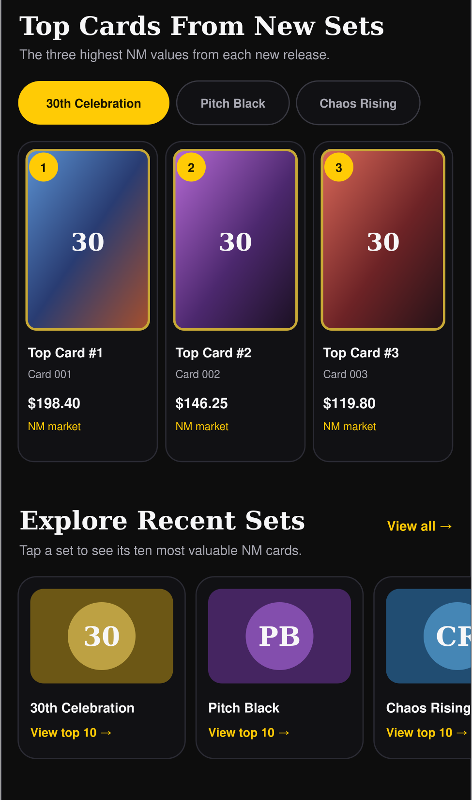

# PokéValuator Homepage Redesign Specification

**Status:** Approved direction for implementation  
**Primary target:** Mobile-first homepage  
**Desktop target:** Responsive adaptation of the same content hierarchy  
**Important pricing rule:** Every card price shown on the homepage must be the strict Near Mint (`NM`) market value.

> The screenshots in this package are product-design references. Names, counts, and prices are illustrative rather than production data.

## 1. Product goal

Make the homepage a fast, focused entry point for two common tasks:

1. Search for a card or sealed product.
2. Discover valuable cards from the newest Pokémon sets.

The homepage should give users a useful preview without becoming a second search-results page. It should feel concise on a phone, support one-handed interaction, and direct deeper research to the existing Card Search and Sealed Search pages.



## 2. Scope

### In scope

- Replace the current homepage hero with a compact value proposition and Cards/Sealed search control.
- Show at most three homepage results after a search.
- Display one price per card on the homepage: strict `NM market`.
- Give users a clear `View all … results` action that opens the appropriate full search page with the query preserved.
- Keep the latest three sets, each with its top three cards by strict NM market value.
- Keep the recent-set logo browser; selecting a set opens its top ten cards in Card Search.
- Add polished loading, empty, error, keyboard, and responsive states.
- Keep account creation/sign-in calls to action near the bottom of the page.
- Add tests for pricing, routing, rendering, responsive behavior, and XSS-safe DOM construction.

### Out of scope

- Do not redesign the existing Card Search results UI.
- Do not redesign the existing Sealed Search results UI.
- Do not remove condition tables, Trade % information, filters, pagination, or other detailed tools from those pages.
- Do not introduce NM terminology for sealed products; sealed products use their existing market-value field.
- Do not change authentication, watchlists, or collection behavior.
- Do not add live search on every keystroke. Homepage search runs on submit or Enter.

## 3. Homepage information architecture

Use this order:

1. Compact site header
2. Hero statement and Cards/Sealed search
3. Search preview, only after a submitted search
4. Top Cards From New Sets
5. Explore Recent Sets
6. Account call to action
7. Compact footer

The approved V1 layout omits the current Daily Snapshot, Built for Quick Checks, and Trending Cards blocks. Remove their homepage markup, but do not delete unrelated search, watchlist, or account logic that may be shared elsewhere.

## 4. Search experience

### Default state

- Heading: `Know what your collection is worth.`
- Supporting copy should be one short sentence.
- A two-option segmented control switches between `Cards` and `Sealed`.
- The search field and yellow submit button form one strong visual unit.
- Cards is the default mode.
- Placeholder examples:
  - Cards: `Search card name or number`
  - Sealed: `Search sealed products`

### Submitted card search

Render a maximum of three compact rows. Each row contains:

- Card image
- Card name
- Set name and collector number
- One right-aligned price
- Literal label `NM market`

The entire row may be clickable. An exact card result should use the existing deep link:

```text
search.html?cardId={encodedCardId}&cardName={encodedCardName}
```

Below the rows, show a full-width action such as:

```text
View all 24 card results
```

It should route to:

```text
search.html?query={encodedQuery}&source=home
```

Add support in `search.js` for the `query` parameter: populate the existing input, run the same current search flow, and render the existing full results UI. Existing `cardId`, `cardName`, `expansionId`, and `expansionName` deep links must continue to work.



### Submitted sealed search

Use the same three-row preview pattern. A sealed row may contain:

- Product image
- Product name
- Product/set subtitle when available
- Current sealed market value with the existing sealed price label

Do not label a sealed price as NM. The full-results action routes to:

```text
sealed.html?query={encodedQuery}&source=home
```

Add equivalent query-prefill and initial-search support to `sealed.js` without changing its full result cards or tools.

### Search states

| State | Required behavior |
|---|---|
| Loading | Reserve space and show three compact skeleton rows. Disable duplicate submission for the same request. |
| Results | Show no more than three rows plus the full-results action. |
| Zero results | Show a short message and an `Open full card search` or `Open full sealed search` action. |
| Error/quota | Keep the rest of the homepage visible; show Retry and Open full search actions. |
| New request | Cancel the prior request when possible or ignore it with a monotonically increasing request ID. |
| Mode switch | Clear the prior preview and update the placeholder and accessible label. |

Use `aria-live="polite"` on the result-status region. After submission, move focus only when it improves keyboard/screen-reader use; do not unexpectedly steal focus while typing.

## 5. Strict Near Mint pricing contract

This is a data requirement, not only a display-label change.

### Applies to

- Homepage card-search preview rows
- The latest three sets' top-card rows
- Any future card price placed on the homepage

### Does not apply to

- Sealed-product values
- The detailed Card Search page, which must continue showing all current conditions and Trade % information

### Required selection algorithm

1. Select the preferred card variant using the existing order: `holofoil`, then `normal`.
2. Within that selected variant, normalize condition labels and select only a Near Mint market value.
3. Recognize existing NM aliases already supported by the application, including `NM`, `Near Mint`, and equivalent normalized forms.
4. Accept only a finite, non-negative numeric market value.
5. Never fall back to LP, MP, HP, damaged, ungraded-any-condition, or another condition on the homepage.
6. If the preferred variant exists but lacks NM, return no homepage price. Do not silently switch condition.
7. Display `NM unavailable` when a normal search result lacks a valid NM price.
8. Exclude cards without a valid NM price from strict-NM top-card rankings.

Example contract:

| Available prices | Homepage result |
|---|---|
| NM $42, LP $35 | `$42.00` / `NM market` |
| LP $35 only | `NM unavailable` |
| NM string `"42.00"` | `$42.00` / `NM market` |
| NM missing, MP $20 | `NM unavailable` |
| Sealed market $120 | `$120.00` with sealed-market label; NM does not apply |

Centralize this behavior in a small shared pricing utility rather than reproducing it in multiple renderers. Suggested pure helpers:

```js
normalizeConditionCode(rawCondition)
getNearMintMarketFromPrices(prices)
getPreferredVariant(cardLike)
getHomeNearMintMarket(cardLike)
```

The detailed search-page resolver may retain its current fallbacks and multi-condition behavior. Give the strict homepage resolver a distinct name so it cannot be confused with the search-page total resolver.

### Top-card API requirement

The current homepage calls `/cards/top-by-expansion`. Confirm that the endpoint itself ranks by strict NM value. Do not fetch a generic top list and merely relabel its prices as NM.

Recommended contract:

```text
GET /cards/top-by-expansion?expansionId={id}&limit=3&lang=en&variantPreference=v2&condition=NM
```

The endpoint must:

- Apply the same preferred-variant and strict-NM rules.
- Exclude entries without NM.
- Sort descending by NM market value.
- Return enough normalized metadata for the homepage row.
- Version or invalidate its cache key when the ranking semantics change (for example `topByExpansion:v4:NM`).

If the worker/API implementation lives outside this repository, locate the deployed source and coordinate that change before considering the feature complete. A client-side label change alone fails acceptance.

## 6. Latest-set discovery

### Top Cards From New Sets

- Use the latest three sets.
- Show three top cards per set, ranked by strict NM market value.
- Each row shows card thumbnail, name, and `NM market` price.
- Each set has a `View set` action using the existing expansion deep link.
- On mobile, use set tabs/chips and show one set panel at a time.
- On tablet/desktop, show the three set panels in a responsive grid when space allows.
- Fetch the three set lists in parallel and preserve the current cache-first expansion behavior.

### Explore Recent Sets

- Show recent set logos in a horizontally scrollable, snap-aligned rail on mobile.
- A partially visible next tile may be used to communicate that the rail scrolls.
- Each tile includes a set logo/name and `View top 10`.
- Selecting a set routes to:

```text
search.html?expansionId={encodedExpansionId}&expansionName={encodedExpansionName}
```

- The destination must load the top ten cards for that set in the existing full Card Search presentation.



## 7. Responsive and visual rules

### Mobile: 320–767 px

- Design first for a 390 px reference width and verify at 320, 360, 390, and 430 px.
- Use approximately 16 px page gutters.
- Maintain at least 44 × 44 px interactive targets.
- Keep search controls visible without horizontal page overflow.
- Stack result metadata cleanly; prevent the price from colliding with long names.
- Use one active newest-set panel plus horizontally scrollable set selectors.
- Recent-set tiles scroll horizontally with CSS scroll snap.
- Avoid excessive vertical copy and repeated explanatory text.

### Tablet: 768–1023 px

- Increase content width while maintaining readable line length.
- Two-column layouts are acceptable where card widths remain usable.

### Desktop: 1024 px and above

- Center content in the site's existing maximum-width container.
- Hero text and search may remain centered.
- Show all three newest-set panels as three columns where practical.
- Keep the page visually compact; do not expand mobile sections into large empty panels.

### Motion and images

- Respect `prefers-reduced-motion`.
- Give images explicit dimensions/aspect ratios to reduce layout shift.
- Lazy-load images below the fold.
- Preserve meaningful `alt` text; decorative logos may use empty alt text when a visible label duplicates them.

## 8. Accessibility and safe rendering

- Use a real `<form>` so Enter submits the search.
- Provide a visible or screen-reader-accessible label for the query field.
- Implement Cards/Sealed as an accessible segmented control using buttons with `aria-pressed` or a properly labeled radio group.
- Maintain visible focus rings.
- Do not rely on color alone for selected, loading, or error states.
- Use semantic headings in order and links for navigation.
- Announce result counts and errors through a polite live region.
- Render all API, URL, Firestore, and storage values as untrusted input.
- Follow the repository rule prohibiting `innerHTML`, `outerHTML`, `insertAdjacentHTML`, and `document.write` for these views.
- Build result elements with `createElement`/`createElementNS`, assign text with `textContent`, validate attributes/URLs, and update collections with `replaceChildren`.
- Never use `eval`, `Function`, or VM execution in production or test code.

## 9. Suggested implementation map

| File | Intended change |
|---|---|
| `index.html` | New homepage semantic structure and compact result region; remove obsolete homepage-only blocks. |
| `styles.css` | Mobile-first layout, segmented control, preview rows, set panels/rail, skeletons, focus, and reduced-motion styles. |
| `script.js` | Search-mode state, submit handling, three-result preview, newest-set rendering, strict NM display, safe DOM rendering, stale-request protection. |
| `search.js` | Accept `query` and `source=home`, prefill input, and run the existing detailed card search; preserve all existing deep links and result behavior. |
| `sealed.js` | Accept `query` and `source=home`, prefill input, and run the existing detailed sealed search. |
| Shared pricing utility | Add the strict homepage NM resolver while retaining the detailed search-page condition resolver. Use the repository's existing script/module style. |
| Worker/API source | Add strict-NM ranking to `top-by-expansion`, with cache-version change. |
| Tests | Add strict-NM, routing, state, safe-rendering, and responsive/static coverage. |

Update cache-busting query strings for changed CSS and JavaScript assets in HTML files if this project uses versioned resource URLs.

## 10. Acceptance criteria

- [ ] The homepage matches the hierarchy and general visual density shown in the supplied mockups.
- [ ] Cards is the default search mode; Cards and Sealed are keyboard- and screen-reader-operable.
- [ ] A homepage search renders no more than three preview results.
- [ ] `View all` preserves the submitted query and opens the correct full search page.
- [ ] Full Card Search still displays its current conditions, Trade %, filters, and other tools.
- [ ] Full Sealed Search still displays its current detailed UI.
- [ ] Every homepage card price is derived from strict NM and is labeled `NM market`.
- [ ] A card with LP/MP/etc. but no NM displays `NM unavailable`; it is never mislabeled.
- [ ] Latest-set top cards are ranked by NM at the API/data layer and omit cards without NM.
- [ ] The latest three sets and their top three cards remain part of the homepage.
- [ ] The recent-set logo rail remains and opens the selected set's top ten cards.
- [ ] Loading, empty, error, and stale-request states behave as specified.
- [ ] No new homepage renderer injects untrusted markup.
- [ ] The page has no horizontal viewport overflow at 320 px.
- [ ] Images do not cause major layout shifts and below-fold images lazy-load.
- [ ] All existing tests pass, and new focused tests pass.

## 11. Minimum test matrix

### Pricing unit tests

- Exact `NM` value is returned.
- `Near Mint`, spacing, and case aliases normalize to NM.
- NM numeric strings parse safely.
- LP-only and MP-only records return no homepage price.
- Non-finite, negative, null, and malformed NM values return no homepage price.
- Preferred variant behavior remains `holofoil`, then `normal`.
- Top-card ranking excludes no-NM cards and sorts descending by NM.

### Routing/integration tests

- Card `View all` encodes and restores the query.
- Sealed `View all` encodes and restores the query.
- Existing card, expansion, and expansion-name deep links still work.
- Recent-set selection requests/displays ten results on the full search page.
- Rapid consecutive searches never render an older response over the newest response.

### Rendering/security tests

- A malicious name, set label, image URL, and URL parameter render as inert text or are rejected.
- New homepage code contains no unsafe HTML-string rendering APIs.
- Focus, accessible names, live status, and selected-mode state are present.
- Static/layout checks cover 320, 390, 768, and 1280 px.

Suggested test names, adjusted to repository conventions:

```text
home-near-mint-price.test.mjs
home-search-preview.test.mjs
home-render-xss-static.test.mjs
home-query-routing.test.mjs
```

Run the repository's full existing test suite in addition to these focused tests.

## 12. Copy/paste Copilot implementation instructions

```text
Implement the PokéValuator homepage redesign described in
PokeValuator_Homepage_Redesign_Spec.md and use the supplied PNG mockups as the
visual reference. Work in small, reviewable changes and do not redesign the
existing full Card Search or Sealed Search result UIs.

First inspect AGENTS.md and the current index.html, script.js, styles.css,
search.js, sealed.js, existing test files, and the implementation of the
/cards/top-by-expansion endpoint. Preserve established naming, routing, cache,
and styling conventions where they do not conflict with this spec.

Core behavior:
1. Build the mobile-first homepage hierarchy from the spec.
2. Add Cards/Sealed homepage search. Submit only on the form submit/Enter.
3. Render at most three compact results, then a View all action.
4. Route card queries to search.html?query=...&source=home and sealed queries
   to sealed.html?query=...&source=home. Extend those scripts to prefill and
   run their existing searches without changing their detailed result views.
5. For every CARD value on the homepage, use a dedicated strict Near Mint
   market resolver. Never fall back to LP, MP, HP, damaged, or any other
   condition. Display “NM unavailable” when a search result has no NM value.
   Sealed products keep their existing market-value logic and must not be
   labeled NM.
6. Keep the latest three sets with three cards each. Make
   /cards/top-by-expansion rank and filter by strict NM at the data/API layer;
   do not just relabel generic prices. Version/invalidate the relevant cache.
7. Keep the recent-set logo rail and route each set to the existing expansion
   search showing its top ten cards.
8. Implement loading, empty, error, and stale-request protection.
9. Use safe DOM construction only. Treat all API/URL/storage data as untrusted.
   Do not use innerHTML, outerHTML, insertAdjacentHTML, document.write, eval,
   Function, or VM execution. Use createElement, textContent, validated URLs,
   and replaceChildren.
10. Preserve accessibility, 44px touch targets, visible focus, reduced motion,
    explicit image dimensions, lazy loading, and no horizontal overflow at
    320px.

Before finishing:
- Add unit tests for strict NM normalization and no-fallback behavior.
- Add tests for View all routing/query restoration, latest-set NM ranking,
  stale response handling, and XSS-safe rendering.
- Run all existing and new tests.
- Verify at 320, 390, 768, and 1280px.
- Report modified files, API/cache changes, test commands/results, and any
  assumptions. Do not claim completion if the backend still ranks top cards
  using a non-NM fallback.
```

## 13. Visual assets included

- `assets/01-mobile-homepage-full.png` — complete mobile page reference
- `assets/02-home-search-preview-nm.png` — focused search-result state
- `assets/03-new-set-sections.png` — newest-set and recent-set behavior
- `assets/homepage-mobile-full.svg` — editable source artwork

